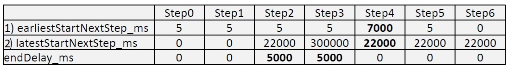
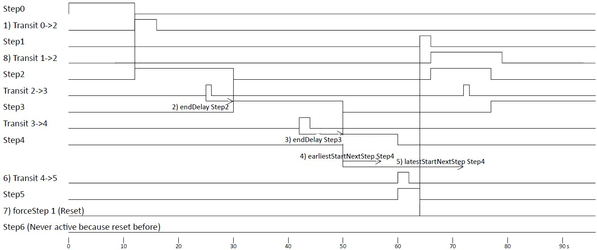
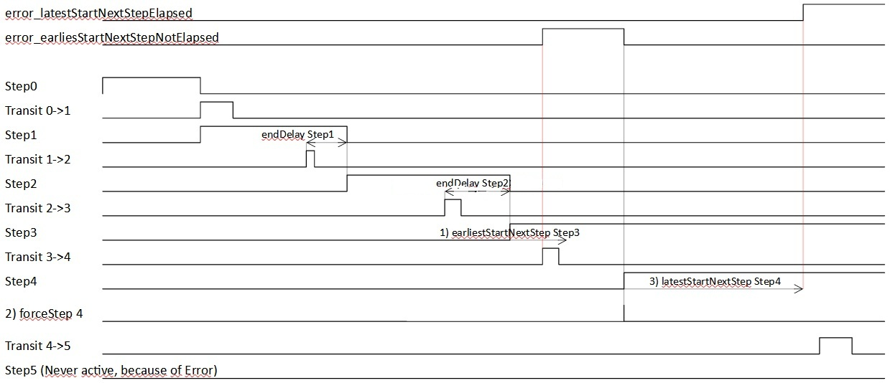

                Step Sequence Timing               19 Aug 2025 Andreas1313
Example for a possible timing for the timing diagramm below:\

a)  Because forceStep skips the startDelay, I would use startDelay only where it makes sense. endDelay is the normal delay.\
b) earliestStartNextStep_ms: When this time is elapsed, it is allowed to transfer to the next step.\
c) latestStartNextStep_ms: The next transit must be in this time. 0 is to switch it totally off.

1) Transit 0->2:&emsp;&emsp;You can transit between every step
2) endDelay Step2:&emsp;&emsp;After the endDelay it switches to the next step.   
3) endDelay Step3   startDelay Step4&emsp;&emsp;If you have both, they are cumulated
4) earliestStartNextStep Step4:&emsp;&emsp;After this time is elapsed, it is allowed to transit to the next Step(5). See error page.
5) latestStartNextStep Step4:&emsp;&emsp;Before this time is elapsed, the transit to Step(5) must be done. See error page.
6) Transit 4->5:&emsp;&emsp;It is between end of earliestStartNextStep Step4 and latestStartNextStep Step4, so it is correct.
7) forceStep 1 (Reset):&emsp;&emsp;Here we jump to Step1 and not to Step0. Perhaps you want to do something different from normal startup at a reset.
8) Transit 1->2:&emsp;&emsp;A transit  can be very long. But of course should be back when this step is called again.
***
**Error**

1) earliestStartNextStep Step3:&emsp;&emsp;The error is immediately when the transit is to early.
The Step4 is not activated here, because of the error.
A startDelay Step4 would not be part of the earliestStartNextStep. So this timing graph would exactly look the same.
2) forceStep 4:&emsp;&emsp;In this example we force Step4. We imagine that the next position was reached manually after the error, and than we force the next step.
   - Errors are reset.
   - Forcing a step skips the startDelay (when Step4 would have a startDelay).
   - latestStartNextStep (and earliestStartNextStep) always start at the activation of a step.
3) latestStartNextStep Step4:&emsp;&emsp;The error is immediately when the latestStartNextStep is elapsed.

Because forceStep skips the startDelay, I would use startDelay only where it makes sense. endDelay is the normal delay.
***
&emsp;&emsp;**Functions and pointer variables**
- void set_nextStep(StepType nextStep)
After _startDelay/_endDelay and no Error, this _nextStep will be the _actualStep.
- void sequenceProcess()
Call this in every loop().
- StepType get_actualStep()
Get the actual active step.
- void set_forceStepImmediately(StepType forceStep);
  - Force to the forceStep 
  - Reset Errors
  - No startDelay

- bool get_error_latestStartNextStepElapsed()  -  in_latestStartNextStep_ms[] 
  - You can use this as fatal error (restart of device, or reset button press – force step).
  - You can use this to try the last step again.
  - You can use this for a warning message and proceed with next step, where you have long time to proceed.
  - You can use this to proceed with half speed.
  - You can directly change in_latestStartNextStep_ms[] of the actual step. And repeat the actual step with forceStepImmediately..
  - ...
- bool get_error_earliestStartNextStepNotElapsed()  -  in_earliestStartNextStep[]
  - You can use this as fatal error (restart of device, or reset button press – force step).
  - You can directly change in_earliestStartNextStep_ms[] of the actual step. And repeat the actual step with forceStepImmediately..

- in_startDelay_ms[] / in_endDelay_ms[]
The delay between two steps is always endDelay + startDelay. Use it where it is more reasonable.
Example for startDelay: Before a cylinder moves, you want to wait a vibration time. So use the startDelay
Example for endDelay: After you send some text to a display, the user should have some time read, but than you want to proceed.
Normally endDelay is used because at forcing to a step the startDelay is skipped.
You can always write to them. They will immediately valid (pointer)

- out_stepTime_ms[]
Do not write to it. It is output of the class.  (pointer).
The stepTime is the time the step is active.
You can use it for
  - Time tracking
  - First measurement, and than set the start/end delay.

&emsp;&emsp;**General Information**
- General sequence chain information
Sequence programming is a programming paradigm that divides a process into a series of steps and transitions.
Each step represents an action or state, while transitions define conditions that must be met to move from the current step to the next.
This type of programming provides clarity, structure, flexibility and efficiency when controlling complex processes in various automation areas. 

- Suggestion to use a sequence chain in general
A sequence chain is complex for small chains, but when you have larger chains it is getting structurated
In one sequence chain always only one step can be active.
So at smaller projects, use one sequence chain where you want that only one step is active.
If you really want to split a sequence chain (where only one reasonable step is active):
At larger projects, it can be clearely arranged to separate in "after power up", "normal run", "before power down" sequence chain.
Strongly recommended: Use at the end of "after power up" and "normal run" a step where you really do nothing (also not jump to other step).
Only a complete reset should start from beginning. If you do a complete reset per software, be aware which steps you activate in which order.

Advantage of sequencer (state machine, step chains) in general
- Clarity: Sequencer enable a clear and concise representation of complex processes.
- Structuring: The division into individual steps simplifies programming and maintenance.
- Flexibility: step chains can be easily adapted to changing requirements.
- Efficiency: The use of step chains can optimize process sequences and increase efficiency. 

Use of step chains
Step chains are used in a variety of areas.
- System control: Control of production systems, conveyor belts, robots, etc.
- Machine control: control of machine tools, injection molding machines, etc.
- Building technology: control of heating, ventilation and air conditioning systems, lighting, etc.
- Robotics: Control of robot movements and actions.
- Shake hand communication

Example step chain:\
Imagine a simple washing machine. One step could be "fill with water", followed by a transition that checks whether the desired amount of water has been reached.
The next step could be "wash", followed by a transition that checks whether the set washing time has elapsed, and so on.

Debounce is during normal sequence step run not necessary. For simple debounce use the endDelay value (for example 50ms).
When you use the forceStep function, for example at reset, it can make sense to have a good debounce.
- Basics of step chain programming
  - Steps
A step is a defined state or action that is executed in a process.

  - Transitions
A transition is a condition that must be met for the process to move from the current step to the next.

  - Sequence
The step chain consists of a sequence of steps and transitions, where each step triggers actions and each transition enables the transition to the next step.

&emsp;&emsp;**Hints for professional users**

A force to the actual step make sense. Example: When you have an error, you can repeat the actual step.
The earliestStartNextStep of this step and the latestStartNextStep of this step also start from beginning.
example: "blink_1.set_nextStep(blink_1.get_actualStep());"

You can use latestStartNextStep not only for critical errors. Example: When you want a warning, you can use it:
Show a warning when you have the error and transfer to next step with a longer latestStartNextStep time.
When you do not have this error, you can skip the next step (with the longer latestStartNextStep time).

When the step after the next step should not be active immediately (which should be the normal case) you can use earliestStartNextStep: When you do not want to allow that the next transfer is already active, when the actual step getting active, than set earliestStartNextStep to a value a little bit more than your processor loop time. It will throw an error when the next step would be immediately activated.

First start values for earliestStartNextStep_ms and latestStartNextStep_ms. When you want a stable run, but also an error, when something is totally running wrong.
- Set all earliestStartNextStep_ms and latestStartNextStep_ms to 0.
- Measure the timing (with this library).
- Set for example: earliestStartNextStep_ms = yourMeasuredTime_ms / 10.
- Set for example: latestStartNextStep_ms = yourMeasuredTime_ms * 10.
- Set only critical timings nearer to yourMeasuredTime.